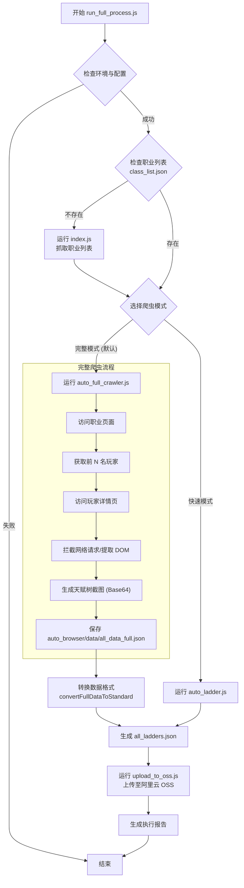

# 项目流程图文档

本文档描述了 `p2-database` 项目的数据获取、处理和上传流程。该项目主要用于从 poe.ninja 抓取《流放之路2》(Path of Exile 2) 的天梯数据，进行解析、翻译（可选），并上传至阿里云 OSS。

## 核心流程概览

整个自动化流程由 `auto_browser/run_full_process.js` 脚本编排。

## 详细模块说明

### 1. 初始化与编排 (`auto_browser/run_full_process.js`)
- **职责**: 整个流程的总指挥。
- **功能**:
  - 检查 `package.json` 和 `oss-config.json` 是否存在且有效。
  - 自动判断是否需要更新职业列表。
  - 根据文件存在情况选择使用 `auto_full_crawler.js` (包含装备/技能/天赋树截图) 还是 `auto_ladder.js` (仅基础信息)。
  - 调用 `upload_to_oss.js` 进行数据上传。
  - 生成 `execution_report_*.json` 报告文件。

### 2. 职业列表获取 (`auto_browser/index.js`)
- **目标 URL**: `https://poe.ninja/poe2/builds`
- **逻辑**:
  - 启动 Puppeteer 浏览器。
  - 筛选当前赛季 (如 "FATE OF THE VAAL") 的职业链接。
  - 排除 Hardcore (hc-), SSF (ssf-), Ruthless (ruthless-) 模式。
  - 提取职业名称和图标，保存为 `class_list.json`。

### 3. 完整数据爬虫 (`auto_browser/auto_full_crawler.js`)
- **核心功能**: 获取深度的玩家构建数据。
- **主要步骤**:
  1. **读取配置**: 加载 `class_list.json`。
  2. **遍历职业**: 对每个职业，抓取前 `MAX_RANK` (默认20或配置值) 名玩家。
  3. **详情抓取**:
     - 进入玩家详情页。
     - **数据拦截**: 监听网络请求 (`/getcharacter` API) 或解析页面 `__NEXT_DATA__` 脚本以获取原始 JSON 数据 (装备、技能)。
     - **天赋树截图**: 滚动页面触发 SVG 渲染，通过 Canvas 将 SVG 转换为 Base64 图片，保留高亮的天赋点。
  4. **数据清洗**: 格式化装备、技能宝石、星团珠宝等信息。
  5. **保存**: 输出 `all_data_full.json`。

### 4. 翻译爬虫 (`auto_browser/translate_crawler.js`)
*注：这是一个独立或可选的流程，用于生成多语言数据。*
- **依赖**: `base-data/dist/` 下的字典文件 (`dict_base.json`, `dict_unique.json` 等)。
- **逻辑**:
  - 与完整爬虫类似，但在保存数据前进行翻译。
  - **物品翻译**: 结合精确匹配和模糊匹配，识别装备基底和传奇名称。
  - **词缀翻译**: 使用正则模式 (`dict_stats.patterns`) 和关键词替换 (`dict_stats.keywords`) 将英文词缀转换为中文。
  - **文件名处理**: 生成带有语言前缀的安全文件名 (如 `cn_hash.json`)。

### 5. 数据上传 (`auto_browser/upload_to_oss.js`)
- **配置**: 读取 `oss-config.json` (AccessKey, Secret, Bucket, Region)。
- **功能**: 将生成的 JSON 数据文件上传到指定的阿里云 OSS 存储桶路径，供前端调用。

## 文件结构映射

| 文件/目录 | 说明 |
| --- | --- |
| `auto_browser/run_full_process.js` | **入口脚本**，流程编排 |
| `auto_browser/index.js` | 职业列表爬虫 |
| `auto_browser/auto_full_crawler.js` | 完整数据爬虫 (含截图) |
| `auto_browser/translate_crawler.js` | 带翻译功能的爬虫 |
| `auto_browser/upload_to_oss.js` | OSS 上传脚本 |
| `base-data/dist/` | 翻译字典目录 |
| `oss-config.json` | OSS 配置文件 (需用户创建) |

