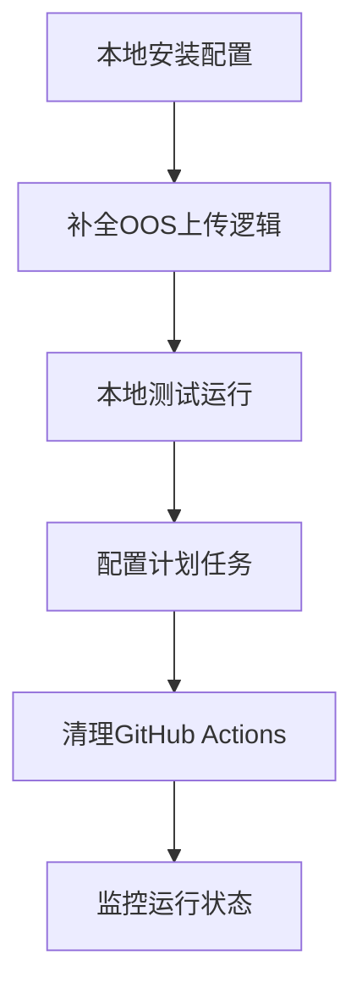

# PoE2-Database 统一爬虫

> 整合 p2-database 和 crawl_economy 的 PoE2（流放之路2）数据爬虫项目。
> 爬取 poe.ninja 天梯数据 → 翻译 → 聚合分析 → 上传阿里云 OSS，为微信小程序「daily-talk」提供数据支撑。

---

## 目录

- [项目架构](#项目架构)
- [功能清单](#功能清单)
- [数据流向](#数据流向)
- [本地部署](#本地部署)
  - [前置要求](#前置要求)
  - [安装与配置](#安装与配置)
  - [运行](#运行)
  - [计划任务（macOS）](#计划任务macOS)
- [所有脚本说明](#所有脚本说明)
  - [爬虫类](#爬虫类)
  - [数据处理类](#数据处理类)
  - [OSS 上传类](#oss-上传类)
  - [工具类](#工具类)
- [GitHub Actions 配置](#github-actions-配置)
- [OSS 数据输出路径](#oss-数据输出路径)
- [常见问题](#常见问题)
- [迁移到本地的可行性分析](#迁移到本地的可行性分析)

---

## 项目架构

```
┌─────────────────────────────────────────────────────────────────┐
│                   数据源（poe.ninja / 踩蘑菇）                     │
└──────────┬─────────────────────────────────────┬──────────────┘
           │                                     │
    ┌──────▼─────────┐                 ┌─────────▼─────────┐
    │  translate_crawler.js │         │  踩蘑菇精华帖爬虫   │
    │  (poe.ninja 天梯)     │         │  (caimogu 社区)    │
    │  ┌ 职业列表导航        │         │                    │
    │  ├ 玩家列表抓取        │         │   crawl_caimogu_   │
    │  ├ 玩家详情API         │         │   essence_full.js  │
    │  ├ 装备/技能翻译       │         │         │          │
    │  ├ 天赋树截图          │         │         ▼          │
    │  └ 生成community.json  │         │   transform_caimogu│
    └────────┬──────────────┘         │   _data.js         │
             │                        └────────┬────────────┘
             ▼                                  │
    ┌─────────────────────────────────────────────▼─────────┐
    │                translated-data/{env}/                    │
    │  ├─ all_ladders_translated.json   ← 天梯索引+翻译        │
    │  ├─ classes.json                  ← 职业列表            │
    │  ├─ players/*.json                ← 各玩家详情数据       │
    │  ├─ ladder_analysis.json          ← 预聚合分析结果       │
    │  └─ miniprogram_data/             ← 小程序专用数据       │
    │       ├─ community.json                                 │
    │       └─ community_full.json                            │
    └──────────────────┬──────────────────────────────────────┘
                       │
                       ▼
    ┌──────────────────────────────────────────────────────────┐
    │                    阿里云 OSS                             │
    │  poe2-all-class.oss-cn-hangzhou.aliyuncs.com             │
    │  ├─ poe2-ladders/release/                                │
    │  │    ├─ all_ladders_translated.json                     │
    │  │    ├─ ladder_analysis.json                            │
    │  │    ├─ classes.json                                    │
    │  │    ├─ players/*.json                                  │
    │  │    └─ miniprogram_data/community.json                 │
    │  └─ poe2-ladders/dev/                                    │
    └──────────────────────────────────────────────────────────┘
                              │
                              ▼
                   微信小程序「daily-talk」
                    ├─ 天梯榜（Ladder 页面）
                    ├─ 通货查询（Ninja 页面）
                    ├─ 中英速查（Dictionary 页面）
                    └─ 社区BD（从 community.json 读取）
```

---

## 功能清单

| # | 功能 | 脚本 | 数据源 | 说明 |
|---|------|------|--------|------|
| 1 | 🏆 天梯翻译 | `translate_crawler.js` | poe.ninja | 扫描职业→玩家列表→API 获取详情→装备/技能翻译→天赋树截图 |
| 2 | 🏆 完整天梯 | `auto_full_crawler.js` | poe.ninja (API) | 用 HTTP API 替代 Puppeteer 获取玩家详情，更轻量、更快 |
| 3 | 📊 天梯分析聚合 | `scripts/aggregate_analysis.js` | 本地文件 | 预聚合职业分布、技能统计、装备统计、天赋统计 |
| 4 | 🔥 热门BD | `crawl_hot_builds.js` | poe.ninja | 提取各职业天梯前几名玩家的 BD 配置 |
| 5 | 📜 踩蘑菇精华帖 | `crawl_caimogu_essence_full.js` | 踩蘑菇社区 | 爬取精华帖→详情→数据转换 |
| 6 | 📰 新闻/经济数据 | `crawl_news.js` / `crawl_economy.js` | 踩蘑菇/官方 | 经济数据与新闻爬取 |
| 7 | 🇨🇳 中英翻译 | `translate_crawler.js` 内联 | 本地字典 | 使用 base-data/dist/ 字典文件进行装备、技能、词缀翻译 |

---

## 数据流向

### 天梯数据流程（核心）

```
1. poe.ninja/poe2/builds
   ↓ Puppeteer 导航
2. 获取职业列表 (Huntress, Druid, Witch, Warrior...)
   ↓ 逐个访问职业页面
3. 获取每个职业前 N 名玩家列表（N=7 生产 / N=3 开发）
   ↓ Puppeteer 逐页访问 + 截获 API 请求
4. 获取每个玩家的详细数据（装备、技能、天赋树）
   ↓ translateItemName() 翻译
5. 保存到 translated-data/{env}/
   ├─ all_ladders_translated.json  ← 索引文件（含排行榜）
   ├─ players/{account}_{name}.json ← 各玩家详情
   ├─ miniprogram_data/community.json ← 热门BD
   └─ ladder_analysis.json         ← 预聚合统计数据
   ↓ upload_to_oss.js / scripts/upload_analysis.js
6. 阿里云 OSS 存储
   ↓
7. 微信小程序读取展示
```

### 当前上传存在的问题

**GitHub Actions 工作流中主爬虫的输出文件（`all_ladders_translated.json`、`players/*.json`）没有被上传到 OSS**，只有 `ladder_analysis.json` 有上传步骤。这是当前数据链路中的一个缺口。

---

## 本地部署

### 前置要求

- **Node.js** ≥ 18
- **Chrome/Chromium**（用于 Puppeteer，本地通常已有）
- **阿里云 OSS 密钥**（ACCESS_KEY_ID + ACCESS_KEY_SECRET）
- 网络可访问 `poe.ninja` 和 OSS 端点

### 安装与配置

```bash
# 1. 安装依赖
npm install

# 2. 配置 OSS 凭证
cp auto_browser/.env.example auto_browser/.env
# 编辑 .env 填入 OSS 密钥
```

### 环境配置 `.env`

```bash
NODE_ENV=production         # production / dev
CI=false                    # 本地运行设为 false
OSS_REGION=oss-cn-hangzhou
OSS_BUCKET=poe2-all-class
OSS_ACCESS_KEY_ID=your_key
OSS_ACCESS_KEY_SECRET=your_secret
OSS_ENDPOINT=https://oss-cn-hangzhou.aliyuncs.com
DEV_OSS_PATH=dev/
PROD_OSS_PATH=release/
```

### 运行

```bash
# 运行全部爬虫（天梯 + 精华帖 + 热门BD + 上传OSS）
node run_crawler.js --all

# 只跑天梯翻译（推荐，最快验证）
NODE_ENV=production node run_crawler.js --translate

# 天梯翻译 + 完整玩家详情
NODE_ENV=production node run_crawler.js --translate --full

# 运行天梯翻译 + 聚合分析 + 上传 OSS（完整流程）
npm run crawl:translate
npm run aggregate
npm run upload-oss
```

### 计划任务（macOS）

使用 macOS 自带的 `launchd` 设置每天定时运行：

```xml
<!-- ~/Library/LaunchAgents/com.poe2.crawler.plist -->
<?xml version="1.0" encoding="UTF-8"?>
<!DOCTYPE plist PUBLIC "-//Apple//DTD PLIST 1.0//EN"
  "http://www.apple.com/DTDs/PropertyList-1.0.dtd">
<plist version="1.0">
<dict>
  <key>Label</key>
  <string>com.poe2.crawler</string>
  <key>ProgramArguments</key>
  <array>
    <string>/usr/local/bin/npm</string>
    <string>run</string>
    <string>crawl:all</string>
  </array>
  <key>WorkingDirectory</key>
  <string>/Users/yourname/Documents/project/p2-database</string>
  <key>StartCalendarInterval</key>
  <array>
    <dict>
      <key>Hour</key>
      <integer>9</integer>
      <key>Minute</key>
      <integer>0</integer>
    </dict>
  </array>
  <key>EnvironmentVariables</key>
  <dict>
    <key>NODE_ENV</key>
    <string>production</string>
  </dict>
  <key>StandardOutPath</key>
  <string>/tmp/poe2-crawler.log</string>
  <key>StandardErrorPath</key>
  <string>/tmp/poe2-crawler.err</string>
</dict>
</plist>
```

或使用 crontab：

```bash
# 每天 UTC 1:00（北京时间 9:00）运行
0 1 * * * cd /Users/zhangyajun/Documents/project/p2-database && NODE_ENV=production node run_crawler.js --translate --full >> /tmp/poe2-crawler.log 2>&1
```

---

## 所有脚本说明

### 爬虫类

| 脚本 | 功能 | 运行方式 | 依赖 |
|------|------|----------|------|
| `translate_crawler.js` | **天梯翻译爬虫（核心）** — 导航 poe.ninja 获取各职业玩家列表，截获 API 数据，翻译装备/技能，截图天赋树 | `NODE_ENV=production node -e "require('./auto_browser/translate_crawler').runTask()"` | Puppeteer, Chrome, 翻译字典 |
| `auto_full_crawler.js` | **完整天梯爬虫** — 用纯 HTTP API 替代 Puppeteer 获取玩家详情，更快更轻量 | 由 `run_crawler.js --full` 触发 | Node http |
| `crawl_caimogu_essence_full.js` | **踩蘑菇精华帖爬虫** — 爬取流放之路2圈子的精华帖列表和详情 | `node auto_browser/crawl_caimogu_essence_full.js` | Puppeteer |
| `crawl_hot_builds.js` | **热门BD爬虫** — 从天梯数据中提取热门BD配置 | 由 `run_crawler.js --hot` 触发 | 无（读本地数据） |
| `crawl_economy.js` | **经济数据爬虫** — 爬取 poe.ninja 经济数据 | `node auto_browser/crawl_economy.js` | Puppeteer |
| `crawl_news.js` | **新闻爬虫** — 爬取游戏新闻 | `node auto_browser/crawl_news.js` | Puppeteer |

### 数据处理类

| 脚本 | 功能 |
|------|------|
| `scripts/aggregate_analysis.js` | **天梯分析预聚合** — 读取 `all_ladders_translated.json` + `players/*.json`，输出职业分布、热门技能/装备/天赋统计到 `ladder_analysis.json` |
| `transform_caimogu_data.js` | 精华帖数据格式转换，适配小程序 |

### OSS 上传类

| 脚本 | 功能 | 上传路径 |
|------|------|----------|
| `auto_browser/upload_to_oss.js` | **通用上传** — 上传整个 `translated-data/{env}/` 目录下所有文件到 OSS | `poe2-ladders/{env}/` |
| `scripts/upload_analysis.js` | **分析数据上传** — 只上传 `ladder_analysis.json` | `poe2-ladders/{env}/ladder_analysis.json` |

### 工具类

| 脚本 | 功能 |
|------|------|
| `env-config.js` | 环境配置管理（dataDir、ossPath、crawler 参数） |
| `config.js` | 旧版配置文件 |
| `run_crawler.js` | 统一入口脚本，调度各爬虫 |

### NPM 快捷命令

```bash
npm run dev              # NODE_ENV=dev 运行全部爬虫
npm run prod             # NODE_ENV=production 运行全部爬虫
npm run cron:dev         # 只跑翻译爬虫（dev）
npm run cron:prod        # 只跑翻译爬虫（production）
npm run crawl:all        # 运行全部
npm run crawl:translate  # 只跑翻译
npm run crawl:essence    # 只跑精华帖
npm run crawl:hot        # 只跑热门BD
npm run crawl:news       # 只跑新闻
```

---

## GitHub Actions 配置

项目当前配置了 4 个 GitHub Actions 工作流：

| 工作流 | 触发条件 | 功能 |
|--------|----------|------|
| `auto-crawl.yml` | 推送 main / 每天 UTC 1:00 / 手动 | **主工作流**：运行天梯翻译爬虫 + 完整爬虫 + 聚合分析 + 上传 OSS |
| `essence_builds.yml` | 手动触发 | 运行踩蘑菇精华帖爬虫 |
| `update_economy.yml` | 定时 | 更新经济数据 |
| `update_news.yml` | 定时 | 更新新闻数据 |

### 已知问题

1. **数据上传不完整**：主工作流中翻译爬虫产出的 `all_ladders_translated.json`、`players/*.json` 等核心文件未上传到 OSS，只有 `ladder_analysis.json` 被上传
2. **超时风险**：GitHub Actions 运行环境资源有限，Puppeteer + 翻译 + 截图处理容易超时（已做优化，深度 7 个玩家）
3. **Chrome 安装耗时**：每次运行都要重新安装 Chrome，浪费 1-2 分钟

---

## OSS 数据输出路径

Bucket: `poe2-all-class` / Region: `oss-cn-hangzhou`

| 数据文件 | OSS 路径 | 小程序加载地址 |
|---------|----------|----------------|
| 天梯索引 + 翻译 | `poe2-ladders/release/all_ladders_translated.json` | https://poe2-all-class.oss-cn-hangzhou.aliyuncs.com/poe2-ladders/release/all_ladders_translated.json |
| 天梯聚合分析 | `poe2-ladders/release/ladder_analysis.json` | https://poe2-all-class.oss-cn-hangzhou.aliyuncs.com/poe2-ladders/release/ladder_analysis.json |
| 社区BD | `poe2-ladders/miniprogram_data/community.json` | https://poe2-all-class.oss-cn-hangzhou.aliyuncs.com/poe2-ladders/miniprogram_data/community.json |
| 精华帖BD | `poe2-ladders/miniprogram_data/essence_builds.json` | https://poe2-all-class.oss-cn-hangzhou.aliyuncs.com/poe2-ladders/miniprogram_data/essence_builds.json |
| 职业列表 | `poe2-ladders/release/classes.json` | https://poe2-all-class.oss-cn-hangzhou.aliyuncs.com/poe2-ladders/release/classes.json |
| 玩家详情 | `poe2-ladders/release/players/*.json` | —（由天梯索引引用） |

---

## 本地方案可行性分析

### 结论：✅ 完全可行，推荐迁移

### 方案对比

| 维度 | GitHub Actions（当前） | 本地运行（目标） |
|------|----------------------|-----------------|
| 运行时间 | ⚠️ 有限制（6小时上限） | ✅ 无限制 |
| Chrome/Puppeteer | ⚠️ 每次重新安装，1-2分钟 | ✅ 本地已安装，秒级启动 |
| 稳定性 | ⚠️ 环境限制，容易超时/崩溃 | ✅ 本地资源充足 |
| 网络 | ⚠️ 可能被 poe.ninja 限流 | ✅ 本地 IP 更稳定 |
| 调试 | ❌ 只能看日志 | ✅ 可本地调试、截图、测试 |
| 数据完整性 | ⚠️ 上传步骤不完整 | ✅ 可控，可补全上传逻辑 |
| 维护成本 | ✅ 自动运行无需干预 | ⚠️ 需配置本地计划任务 |
| 电脑待机 | — | ⚠️ 运行期间需要开机 |

### 迁移步骤



**具体步骤：**

1. **补全 upload_to_oss.js 上传逻辑**（当前缺口修复）
   - 确保 `all_ladders_translated.json`、`players/*.json`、`ladder_analysis.json` 全部上传
   
2. **本地首次运行测试**
   ```bash
   NODE_ENV=production node run_crawler.js --translate --full
   node scripts/aggregate_analysis.js
   node -e "require('./auto_browser/upload_to_oss')()"
   ```

3. **配置每日定时任务**
   - 使用 macOS `launchd` 或 `crontab` 设置 UTC 1:00 自动运行
   - 日志输出到文件便于排查

4. **（可选）保留 GitHub Actions 作为备用**
   - 降低触发频率（如每周一次）
   - 或保留手动触发

### 推荐实施路径

```bash
# 1. 安装依赖
npm install

# 2. 本地测试天梯爬虫（先试开发模式）
NODE_ENV=dev node run_crawler.js --translate

# 3. 确认 OSS 上传
NODE_ENV=dev node -e "require('./auto_browser/upload_to_oss')()"

# 4. 没问题后切生产模式
NODE_ENV=production node run_crawler.js --translate --full

# 5. 聚合分析
node scripts/aggregate_analysis.js

# 6. 上传到 OSS
NODE_ENV=production node -e "require('./auto_browser/upload_to_oss')()"

# 7. 配置 crontab（每天北京时间 9:00）
crontab -e
# 添加：
# 0 1 * * * cd /Users/zhangyajun/Documents/project/p2-database && node run_crawler.js --translate --full >> /tmp/poe2-crawler.log 2>&1
```

---

## 目录结构

```
p2-database/
├── auto_browser/              # 爬虫脚本
│   ├── translate_crawler.js   # 📌 核心：天梯翻译爬虫
│   ├── auto_full_crawler.js   # 📌 完整天梯爬虫（HTTP API）
│   ├── auto_ladder.js         # 旧版天梯爬虫（已弃用）
│   ├── crawl_caimogu_essence_full.js  # 踩蘑菇精华帖
│   ├── crawl_hot_builds.js    # 热门BD
│   ├── crawl_economy.js       # 经济数据
│   ├── crawl_news.js          # 新闻
│   ├── upload_to_oss.js       # 📌 OSS 上传
│   ├── env-config.js          # 环境配置
│   └── config.js              # 旧版配置
├── scripts/                   # 工具脚本
│   ├── aggregate_analysis.js  # 📌 天梯分析聚合
│   └── upload_analysis.js     # 分析数据上传
├── base-data/dist/            # 翻译字典
│   ├── dict_base.json         # 基础物品
│   ├── dict_unique.json       # 传奇物品
│   ├── dict_gem.json          # 技能宝石
│   └── dict_stats.json        # 词缀
├── translated-data/           # 爬虫输出
│   ├── release/               # 生产环境数据
│   └── dev/                   # 开发环境数据
├── .github/workflows/         # GitHub Actions
│   └── auto-crawl.yml         # 主工作流
├── run_crawler.js             # 📌 统一入口
├── fc-function/               # 阿里云函数计算（备用）
└── package.json               # NPM 配置
```

---

## 常见问题

### Q: Puppeteer 报 CallbackRegistry ProtocolError 怎么办？
A: 通常是浏览器内存泄漏或连接超时。已内置定期重启机制（每 3 个职业重启一次浏览器），本地环境下可改为每 10 个职业重启一次。

### Q: 本地运行需要多久？
A: 生产模式（深度 7）大约 5-8 分钟完成全部天梯抓取 + 翻译 + 截图。

### Q: OSS 上传失败？
A: 检查 `.env` 中的 OSS_ACCESS_KEY_ID / OSS_ACCESS_KEY_SECRET 是否正确，以及 `NODE_ENV` 是否设置正确（决定上传到 release 还是 dev 目录）。

---

## 许可证

ISC
